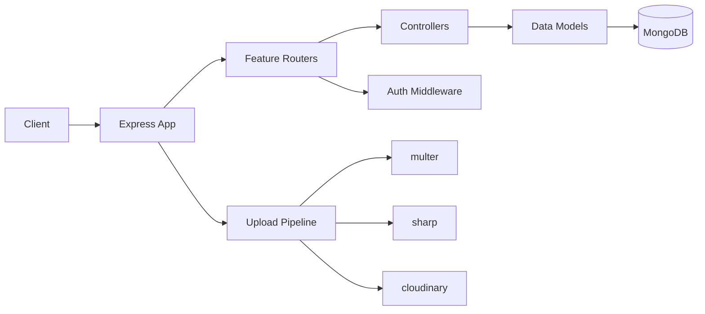
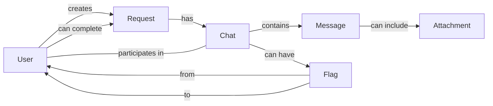

# Backend UML

```mermaid
%% Diagram 1: High-level backend architecture
flowchart LR
  Client[Client] --> ExpressApp[Express App]
  ExpressApp --> Routers[Feature Routers]
  Routers --> Controllers[Controllers]
  Controllers --> Models[Data Models]
  Models --> Database[(MongoDB)]
  Routers --> Auth[Auth Middleware]
  ExpressApp --> Upload[Upload Pipeline]
  Upload --> Multer[multer]
  Upload --> Sharp[sharp]
  Upload --> Cloudinary[cloudinary]
```

```mermaid
%% Diagram 2: Domain overview
flowchart LR
  User[User]
  Request[Request]
  Chat[Chat]
  Message[Message]
  Attachment[Attachment]
  Flag[Flag]

  User -->|creates| Request
  User -->|can complete| Request
  Request -->|has| Chat
  User ---|participates in| Chat

  Chat -->|contains| Message
  Message -->|can include| Attachment
  Chat -->|can have| Flag
  Flag -->|from| User
  Flag -->|to| User
```
